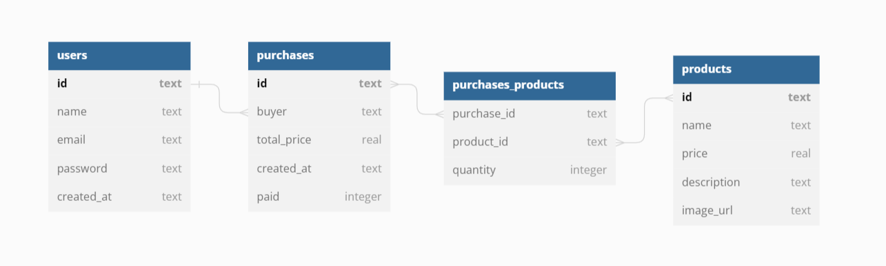

# **Projeto LabeCommerce Backend**

## Índice:

- <a href="#Objetivo"> Objetivo </a>
- <a href="#Documentação da API"> Documentação da API </a>
- <a href="#Estruturação do banco de dados"> Estruturação do banco de dados </a>
- <a href="#Requisitos"> Requisitos: </a>
- <a href="#Como rodar este projeto?"> Como rodar este projeto? </a>
- <a href="#Técnologias utilizadas"> Técnologias utilizadas </a>
- <a href="#Autoria"> Autoria </a>
- <a href="#Próximos Passos"> Próximos Passos </a>

## Objetivo

O objetivo desse projeto é a criação de API com funcionalidades CRUD no projeto Labecommerce - Backend. Colocando em prática informações adquiridas durante as aulas no módulo 3.

## Documentação da API

Link Demonstração: ******\*\*******

## Estruturação do banco de dados

img aqui


## Requisitos:

- [ ] Cadastro de usuário
- [ ] Cadastro de produtos
- [ ] Cadastro de compras
- [ ] Visualizar usuários cadastrados
- [ ] Visualizar produtos cadastrados
- [ ] Visualizar compras cadastradas, junto com dados do usuário que realizou a compra e informações dos produtos adicionados
- [ ] Editar informações do usuário
- [ ] Editar informações do produto
- [ ] Deletar usuário
- [ ] Deletar produto

## Como rodar este projeto?

```bash
#Clone este repositório
$ git clone lin krepo

#Acesse a pasta do projeto no seu terminal
$ cd nomeDaPasta

# Instale as dependencias
$ npm install

# Execute a aplicação
$ npm run dev

# A aplicação será iniciada na porta 3000, acesse pelo navegador: http://localhost:3000

```

## Técnologias utilizadas

1. [Node.js](https://nodejs.org/en)
2. [TypeScript](https://www.typescriptlang.org/)
3. [Express](https://expressjs.com/)
4. [Knex](https://knexjs.org/)
5. [SQLite3 / SQL](https://sqlite.org/index.html)
6. [Postman](https://www.postman.com/)

## Autoria

Michelle Antunes, abril/2023.
Linkedin: www.linkedin.com/in/michelle-antunes-868b24156
Email: miichelleantunes@outlook.com

## Próximos Passos

- [ ] Deploy
- [ ] Testes unitários
